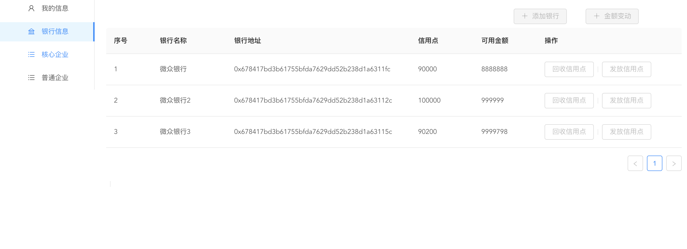
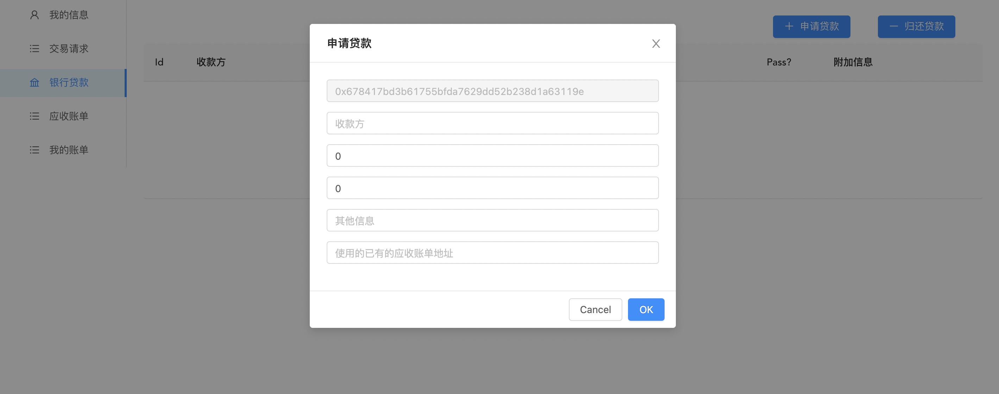

# 区块链大作业：<br>基于区块链的供应链金融平台

| 专业             | 学号     | 姓名   | 分工     |
| ---------------- | -------- | ------ | -------- |
| 软件工程         | 18342001 | 白家栋 | 后端实现 |
| 软件工程         | 18342005 | 曹鉴恩 | 前端实现 |
| 计算机科学与技术 | 18340045 | 关雅雯 | 链端实现 |


## 项目背景及要求

### 背景


#### 传统供应链金融的劣势

某车企（宝马）因为其造车技术特别牛，消费者口碑好，所以其在同行业中占据绝对优势地位。因此，在金融机构（银行）对该车企的信用评级将很高，认为他有很大的风险承担的能力。在某次交易中，该车企从轮胎公司购买了一批轮胎，但由于资金暂时短缺向轮胎公司签订了1000万的应收账款单据，承诺1年后归还轮胎公司1000万。这个过程可以拉上金融机构例如银行来对这笔交易作见证，确认这笔交易的真实性。在接下里的几个月里，轮胎公司因为资金短缺需要融资，这个时候它可以凭借跟某车企签订的应收账款单据向金融结构借款，金融机构认可该车企（核心企业）的还款能力，因此愿意借款给轮胎公司。但是，这样的信任关系并不会往下游传递。在某个交易中，轮胎公司从轮毂公司购买了一批轮毂，但由于租金暂时短缺向轮胎公司签订了500万的应收账款单据，承诺1年后归还轮胎公司500万。当轮毂公司想利用这个应收账款单据向金融机构借款融资的时候，金融机构因为不认可轮胎公司的还款能力，需要对轮胎公司进行详细的信用分析以评估其还款能力同时验证应收账款单据的真实性，才能决定是否借款给轮毂公司。这个过程将增加很多经济成本，而这个问题主要是由于该车企的信用无法在整个供应链中传递以及交易信息不透明化所导致的。

#### 区块链+供应链金融的优势

将供应链上的每一笔交易和应收账款单据上链，同时引入第三方可信机构来确认这些信息的交易，例如银行，物流公司等，确保交易和单据的真实性。同时，支持应收账款的转让，融资，清算等，让核心企业的信用可以传递到供应链的下游企业，减小中小企业的融资难度。

### 项目要求

- 功能一：实现采购商品一签发应收账款交易上链。例如车企从轮胎公司购买一批轮胎并签订应收账款单据。

- 功能二：实现应收账款的转让上链，轮胎公司从轮毂公司购买一笔轮毂，便将于车企的应收账款单据部分转让给轮毂公司。轮毂公司可以利用这个新的单据去融资或者要求车企到期时归还钱款。

- 功能三：利用应收账款向银行融资上链，供应链上所有可以利用应收账款单据向银行申请融资。

- 功能四：应收账款支付结算上链，应收账款单据到期时核心企业向下游企业支付相应的欠款。


## 方案设计

### 金融资源

对场景进行分析，可知系统中有两种金融资源在流通：一种是**现金（cash）**，即实际的货币，如人民币等；另一种是**信用值（或称信用点，credit point）**，表示某个企业在将来的一定时间内有能力支付（偿还）一定的金额。

### 角色

整个系统可以抽象出以下角色：

- 管理员（administrator）：系统的管理者，可控制系统总信用值，从而控制整个系统总体的借贷情况
- 银行（bank）：金融机构的代表，企业可以向银行贷款（即获得融资）从而获取生产资金
- 第三方监管认证机构（trusted third-party certifier)：对企业进行认证，可将企业认证为普通企业和核心企业
- 企业（company）
  - 核心企业：占据优势地位的企业，信用评级高，还贷能力强
  - 普通企业：中下游普通企业


### 流程解析

下图展示了一个车企生产的流程：


#### 管理员宏观调控系统总借贷

初始状态下，系统中所有实体的信用值都为0，即所有实体的借贷能力均为0。管理员可以给银行发放信用值，相当于允许银行最多发放的现金贷款总金额。

管理员也可以强制要求银行返回一定的信用值。

通过对信用值的调控，管理员可以对系统的总借贷情况进行宏观调控。

#### 核心企业认证

企业需要注册为普通企业或核心企业。由于系统中的企业总数可能是一个庞大的数值，全部由管理员来认证可能会造成阻塞，因此引入了第三方监管机构。第三方监管机构可将企业认证为普通企业和核心企业。

#### 银行授信核心企业

核心企业的信用等级高，还贷能力强，银行通过转移信用值给核心企业来完成对核心企业的授信，转移的信用值数量代表了核心企业的信用等级。

核心企业拥有一定的信用值后，该企业就可以在没有现金的情况下向中下游企业购买生产资料（转移信用值给中下游企业），即赊账。

#### 交易

企业之间会发生交易（tracsaction），即一方为买家（付款方），一方为卖家（收款方），买家从卖家处获得产品，并将等价值的信用值转移给卖家，承诺在一定期限（deadline）之前会付款给卖家，系统生成一张应收账款单（receipt），注明买卖双方、金额、期限等信息。

交易有两种方式：

- 生成新的应收账款单：一般用于核心企业向中下游企业购买产品；
- 转让应收账款：一般用于中下游企业之间购买产品。

#### 融资（贷款）

企业可凭借自己的应收账款单（相当于凭借自己的信用值）向银行贷款，企业将等价值的信用值转移给银行，银行向企业发放等价值的现金。

#### 还款：交易、融资

买家需要还款给卖家，企业需要还款给银行。还款时，付款方将等价值的现金转移给收款方，收款方将等价值的信用值还给付款方。


### 辅助功能

#### 数字签名

区块链中的账户地址为用户的公钥，公钥是公开的，同时用户保存自己的私钥，私钥是保密的。数字签名的原理是：利用私钥加密消息，密文可通过公钥解密。因此，可确认消息是有效的（的确是由发送方发出的），并且未经篡改。

为了提高系统的安全性，所有的中下游交易必须能追溯到源头交易（也就是核心企业发起的交易）。并且，银行授信核心企业之后，银行是作为核心企业的信用担保人。因此，交易中需要添加核心企业和银行的数字签名：有核心企业发起的交易，核心企业以及转移信用值给核心企业的银行对应收账款单进行数字签名；通过应收账款转移，中下游企业的应收账款单中也保留了源头的核心企业和银行的数字签名，中下游企业可方便地验证应收账款单的有效性，监管者也可方便地追踪应收账款的授信来源。


#### 电子钱包

企业还款时，可以在第三方机构的认证下，在现实生活中给收款方转账，然后在本供应链系统中标记为已经还款。

另一种更为方便的方式，也是本系统所采用的方式是：企业相当于拥有一个电子钱包，企业在现实生活中到银行存现金，银行在本供应链系统中为企业添加等价的现金数值。还款时，只需要从电子钱包中一键转账即可，合约会自动检测应收账款单是否已经还清。


## 存储设计

采用FISCO-BCSO提供的分布式数据库合约Table.sol，即链端就是具有自己的数据库。系统中存在以下几个实体，分别对应数据库中的表格。

### 管理员

系统中只有一个管理员，所以不单独为管理员开一张表。

```c#
struct Administrator {
        address addr; // 管理员公钥地址
        uint256 outCredit; // 管理员发放的信用值总数
    }

mapping(address => uint256) outCreditPerBank; // 记录管理员给每个银行发的信用值
```

### 第三方监管机构

监管机构的存储结构简单，只需要存储地址和名称即可。监管机构只负责认证，不参与交易。对应于数据库的CertifierTable。

```c#
struct Certifier {
        address addr; // 监管机构公钥地址
        string name; // 监管机构名称
    }
```

### 银行、企业

银行、核心企业、核心企业的存储结构非常相近，故实现上共享一个Company结构，对应于数据库的CompanyTable：

```c#
struct Company {
        address addr; 
        string name;
        uint256 cType; // 类型：银行、核心企业、普通企业之一
        uint256 creditAmount; // 信用值余额
        uint256 cashAmount; // 现金余额
    }

// 由于分布式数据库不接受enum类型，所以使用uint256类型代替。
uint256 cType_normal = 0; // 普通企业
uint256 cType_core = 1; // 核心企业
uint256 cType_bank = 2; // 银行
```

### 交易、融资

交易和贷款的存储结构非常相近，故实现上共享同一个Transaction结构。两者的主要区别在于：交易的收款方（卖家）是企业，融资的收款方（债权人）是银行。

每一笔交易（融资）的分为两个过程，需要付款方（买家、债务人）需要向收款方（卖家、债权人）发送交易请求，收到请求后，收款方（卖家、债权人）向付款方（买家、债务人）发送交易响应，回复同意或者拒绝，只有当收款方同意请求后才会发生信用值的转移。故需要记录交易请求的状态requestStatus。

对应于数据库的TransactionTable。

```c#
struct Transaction {
        address payeeAddr; // 收款方（交易的卖家，或融资的债权人）
        address payerAddr; // 付款方（交易的买家，或融资的债务人）
        int256 id; // transaction的id
        uint256 amount; // 交易或融资的金额
        uint256 createTime; // 创建时间
        uint256 deadline; // 还钱期限
        uint256 tMode; // 两种交易方式：源头交易，或应收账款单转移产生的交易（融资必须是后者）
        int256 oriReceiptId; // 若使用应收账款转移，转移使用的应收账款单
        uint256 requestStatus; // 请求的状态
  			string bankSignature; // 银行签名
        string coreCompanySignature; // 核心企业签名
        string info; // 附加的备注信息
        uint256 isFinance; // 标记是否融资
    }

// 由于分布式数据库不接受enum类型，所以使用uint256类型代替。
// 请求状态
uint256 RequestStatus_sent = 0;
uint256 RequestStatus_accepted = 1;
uint256 RequestStatus_refused = 2;
// 交易方式
 uint256 TransactionMode_new = 0; // 源头新交易
uint256 TransactionMode_transfer = 1 // 应收账款转移的交易
```

### 应收账款单

交易会产生账单，融资也会产生账单，交易和融资记录事件（发生了这样一件事情），而账单记录金融上的债务关系。

```c#
struct Receipt {
        address payeeAddr; // 收款方
        address payerAddr; // 付款方
        int256 id; // 应收账款单的id
        uint256 paidAmount; // 已经还了的金额
        uint256 oriAmount; // 账单的总金额
        uint256 createTime; // 创建时间
        uint256 deadline; // 还钱期限
        uint256 receiptStatus; // 账单状态
        string bankSignature; // 银行签名
        string coreCompanySignature; // 核心企业签名
        string info; // 附加的备注信息
        uint256 isFinance; // 标记是否由融资产生的账单
    }

// 由于分布式数据库不接受enum类型，所以使用uint256类型代替。
// 账单状态：正在支付，或已经还清
uint256 ReceiptStatus_paying = 0;
uint256 ReceiptStatus_settled = 1;
```

### 数据库

综上所述，数据库的schema如下：

```c#
TableFactory tf = TableFactory(0x1001);
tf.createTable(
  CertifierTable, 
  "addr", 
  "name"
);
tf.createTable(
  CompanyTable,
  "addr",
  "name,cType,creditAmount,cashAmount"
);
tf.createTable(
  TransactionTable,
  "payeeAddr",
  "payerAddr,id,amount,createTime,deadline,tMode,oriReceiptId,requestStatus,bankSignature,coreCompanySignature,info,isFinance"
);
tf.createTable(
  ReceiptTable,
  "payeeAddr",
  "payerAddr,id,paidAmount,oriAmount,createTime,deadline,receiptStatus,bankSignature,coreCompanySignature,info,isFinance"
);
```


## 功能实现

### 开发环境

#### 前端

- 语言: Vue 2.x
- 框架: @vue/cli 4.5.11
- 界面库: ant-design-vue
- 网络请求组件: nodejs-axios

#### 后端

使用了轻量级的 koa2 框架，同时基于 fisco-bcos 官方提供的 nodejs-sdk，实现了与链端的高效适配和调用，以及和前端的沟通。

#### 链端

- 语言：Solidity
- 使用FISCO-BCOS部署联盟平台，搭建webase-front平台开发


设计了以下事件：

```c#
event NewRegistration(address addr, string name, string rType);
event UpdateCompany(address addr, string name, string field, uint256 value, string cType);
event UpdateCompany2(address addr, string name, string field_1, uint256 value_1, string field_2, uint256 value_2, string cType);
event NewRequest(address payeeAddr, string payeeName, address payerAddr, string payerName, int32 id, uint256 amount, string rType);
event NewRespond(address payeeAddr, string payeeName, address payerAddr, string payerName, int32 id, uint256 amount, uint256 respond, string rType);
event NewTransaction(address payeeAddr, address payerAddr, int32 id, uint256 amount, string tType);
event NewReceipt(address payeeAddr, address payerAddr, int32 id, uint256 oriAmount, string tType);
event UpdateReceipt(address payeeAddr, address payerAddr, int32 id, uint256 paidAmount, uint256 oriAmount, string tType);
```


### 角色认证

角色认证的设计如下：

- 管理员可以认证银行、第三方监管机构
- 监管机构可以认证企业（普通企业或核心企业）

以监管机构认证普通企业为例：

```c#
		/** 只有certifier能认证公司（normal） */
    function registerCompany(
        address senderAddr,
        address companyAddr,
        string name
    ) public {
        // Only certifier can register certifiers.
        // Administrator can register itself to be a certifier.
        findCertifier(senderAddr);
        insertCompany(companyAddr, name, cType_normal, 0, 0);
    }
```

findCertifier是在数据库的CertifierTable中查找特定的监管机构，找不到或找到多个记录均会报错：

```c#
function findCertifier(address addr) private {
        Table t_certifier = openTable(CertifierTable);
        Entries entries =
            t_certifier.select(toString(addr), t_certifier.newCondition());
        require(entries.size() > 0, "Certifier should exist.");
        require(entries.size() < 2, "Certifier should be unique.");
        Entry entry = entries.get(0);
        certifier.addr = addr;
        certifier.name = entry.getString("name");
    }
```

insertCompany是将新的企业记录插入CompanyTable：

```c#
 function insertCompany(
        address addr,
        string name,
        uint256 cType,
        uint256 creditAmount,
        uint256 cashAmount
    ) private {
   			// 将记录插入数据库表格中
        Table t_company = openTable(CompanyTable);
        Entries entries =
            t_company.select(toString(addr), t_company.newCondition());
        require(entries.size() == 0, "Company or bank already exists.");
        Entry entry = t_company.newEntry();
        entry.set("name", name);
        entry.set("cType", cType);
        entry.set("creditAmount", creditAmount);
        entry.set("cashAmount", cashAmount);
        t_company.insert(toString(addr), entry);
				// 记录出现过的地址，用于后续查询
        if (isAddrAppeared[addr] == false) {
            addrs[addrCount++] = addr;
            isAddrAppeared[addr] = true;
        }
   			// 触发事件
				string memory rType;
        if (cType == cType_bank) {
            rType = "Bank";
            isCTypeBank[addr] = true;
            bankCount++;
        } else {
            rType = "Company(Normal)";
            isCTypeNormal[addr] = true;
            normalCount++;
        }
        emit NewRegistration(addr, name, rType);
    }
```

### 鉴权

特定的函数只有特定的角色才能够调用，因此需要鉴权。我们没有采用在合约中require msg.sender的做法，而是将鉴权操作交给了后端实现，合约中需要鉴权的函数添加senderAddr参数，后端负责判断函数的调用者地址与其senderAddr是否相同，从而完成鉴权。

### 管理员宏观调控系统总借贷、银行授信核心企业

管理员宏观调控系统总借贷的方式是：

- 管理员向银行分发信用值，相当于允许银行最多发放的现金贷款总金额；
- 管理员强制要求银行返还信用值。

银行授信核心企业的方式十分类似：

- 银行向核心企业发放信用值，相当于允许核心企业赊账交易的总金额；
- 银行强制要求核心企业返还信用值。

由于两者的实现逻辑十分类似，故以银行分发、 强制回收信用值为例：

银行分发信用值给核心企业：

```c#
	/** bank将credit分发给core company*/
    function creditDistributionToCore(
        address senderAddr, // bankAddr
        address coreAddr,
        uint256 amount
    ) public {
        findCompany(senderAddr, true); // 由于银行与企业共享Company数据结构，true表示查找的是银行而不是企业
        require(
            company.creditAmount >= amount, // 要求银行有足够的信用值
            "Bank doesn't have enough credit."
        );
        uint256 bankCreditAmount = company.creditAmount;

        findCompany(coreAddr, false);
        require(
            company.cType == cType_core, // 要求企业必须是核心企业
            "Must distribute credit to core company." 
        );
				// 信用值更新
        updateCompanyUInt1(senderAddr, "creditAmount", bankCreditAmount - amount);
        updateCompanyUInt1(coreAddr, "creditAmount", company.creditAmount + amount);
    }
```

银行强制回收核心企业的信用值是上述过程的逆过程，逻辑十分相似，故不再赘述，详情请见代码。

### 交易、融资

交易和融资的逻辑相似，故抽象出private的函数，实际的交易和融资相当于对该底层函数的进一步封装。

#### 请求

付款方发送交易或融资请求，等待收款方回复，请求时信用值和现金均不变。

```c#
/** 交易或融资请求的底层抽象 */
function _transactionRequest(
        address payerAddr,
        bool isPayerBank,
        address payeeAddr,
        bool isPayeeBank,
        uint256 amount,
        uint256 deadline,
        uint256 tMode,
        int32 oriReceiptId,
        string memory info,
        string memory tType,
  			string memory bankSignature,
  			string memory coreCompanySignature
    ) private {
        require(amount > 0, "Amount <= 0 is not allowed."); // 交易或融资金额必须大于0
        // 两种交易方式：新的源头交易，或应收账款转移。融资必是后者。
  			require(
            tMode == 0 || tMode == 1,
            "tMode should be 0 or 1: 0 stands for making new receipt, 1 stands for transfering origin receipt"
        );
        // 付款者鉴权
        findCompany(payerAddr, isPayerBank);
        string memory payerName = company.name;
        require(
            company.creditAmount >= amount, // 付款者将转出信用值
            "Payer doesn't have enough credit points."
        );
        // 收款者鉴权
        findCompany(payeeAddr, isPayeeBank);
        if (isPayeeBank == true) { // 如果收款者是银行，说明是融资而不是交易，银行需要转现金给企业
            require(
                company.cashAmount >= amount, // 判断银行是否有足够的现金
                "Bank doesn't have enough cash."
            );
        }
				// 交易模式判断和处理
        if (tMode == TransactionMode_transfer) { // 应收账款转移
            findReceipt(toString(payerAddr), oriReceiptId);
            require(
                receipt.oriAmount - receipt.paidAmount >= amount,
                "Not enough unpaid money in origin receipt."
            );
            require(
                receipt.deadline >= deadline,
                "Deadline of finance should >= deadline of oriReceipt."
            );
        } else { // 产生新的源头交易（则没有原应收账款单）
            oriReceiptId = 0;
        }
				// 生成新的交易（融资），交易（融资）的状态为RequestStatus_sent
        int32 transactionId = int32(keccak256(abi.encodePacked(now)));
        if (transactionId < 0) {
            transactionId = -transactionId;
        }
        insertTransaction(payeeAddr, payerAddr, transactionId, amount, now, deadline, tMode, oriReceiptId, RequestStatus_sent, bankSignature, coreCompanySignature, info, 0);
        emit NewRequest(payeeAddr, company.name, payerAddr, payerName, transactionId, amount, tType);
    }
```

#### 响应

收款方回应付款方的请求，若同意则根据情况发生：

- 生成新的源头应收账款单
- 分裂原应收账款单
- 发生信用值的转移
- 发生现金的转移（融资）

```c#
		/** 交易或融资响应的底层抽象 */
		function _transactionRespond(
        address payeeAddr, 
        bool isPayeeBank,
        address payerAddr, 
        bool isPayerBank,
        int32 transactionId,
        uint256 respond,
        string memory tType,
      	string memory bankSignature,
  			string memory coreCompanySignature
    ) private {
 				// 限制响应只能为同意或拒绝
        require(
            respond == 0 || respond == 1,
            "Respond is 0 or 1: 0 stands for refusing, 1 stands for accepting."
        );
				// 查找该交易或融资请求记录
        findTransaction(toString(payeeAddr), transactionId);
        uint256 amount = transaction.amount;
        int32 oriReceiptId = transaction.oriReceiptId;
				// 如果是融资，银行需要有足够的现金
        findCompany(payeeAddr, isPayeeBank);
        if (isPayeeBank == true) {
            require(
                company.cashAmount >= amount,
                "Bank doesn't have enough cash."
            );
        }
				// 拒绝请求：状态更改为RequestStatus_refused
        if (respond == 0) {
            updateTransactionUInt1(toString(payeeAddr), transactionId, "requestStatus", RequestStatus_refused);
        } 
      	// 	同意请求：状态更改为RequestStatus_accepted
      	else {
          	// 判断付款方是否有足够的信用值
            findCompany(payerAddr, isPayerBank);
            require(
                company.creditAmount >= amount,
                "Payer doesn't has enough credit points."
            );
            address newReceiptPayerAddr;
            if (transaction.tMode == TransactionMode_transfer) {
                // 交易方式：分裂原应收账款单
                findReceipt(toString(payerAddr), oriReceiptId);
                require(
                    receipt.oriAmount - receipt.paidAmount >= amount,
                    "Not enough unpaid money in origin receipt."
                );
                updateReceiptUInt1(toString(payerAddr), oriReceiptId, "oriAmount", receipt.oriAmount - amount);
                newReceiptPayerAddr = receipt.payerAddr;
            } else {
                // 交易方式：生成新的源头账款单
                newReceiptPayerAddr = payerAddr;
            }
            // payer
            findCompany(payerAddr, isPayerBank);
            string memory payerName = company.name;
            if (isPayeeBank == false) { // 交易
                updateCompanyUInt1(payerAddr, "creditAmount", company.creditAmount - amount);
            } else { // 融资
                updateCompanyUInt2(payerAddr, "creditAmount", company.creditAmount - amount, "cashAmount", company.cashAmount + amount);
            }
            // payee
            findCompany(payeeAddr, isPayeeBank);
            if (isPayeeBank == false) { // 交易
                updateCompanyUInt1(payeeAddr, "creditAmount", company.creditAmount + amount);
            } else { // 融资
                updateCompanyUInt2(payeeAddr, "creditAmount", company.creditAmount + amount, "cashAmount", company.cashAmount - amount);
            }
          	// 无论哪种交易方式，都要生成一张新的应收账款单
            int32 receiptId = int32(keccak256(abi.encodePacked(now)));
            if (receiptId < 0) {
                receiptId = -receiptId;
            }
            insertReceipt(payeeAddr, newReceiptPayerAddr, receiptId, 0, amount, now, transaction.deadline, ReceiptStatus_paying, bankSignature, coreCompanySignature, transaction.info, 0);
            // 更新交易状态
          	updateTransactionUInt1(toString(payeeAddr), transactionId, "requestStatus", RequestStatus_accepted);
        }
      	// 触发响应事件
        emit NewRespond( payeeAddr, company.name, payerAddr, payerName, transactionId, amount, respond, tType);
    }
```

#### 数字签名

数字签名在后端进行加密和验证，代码如下：

```javascript
var crypto = require('crypto');
var sign = crypto.createSign('RSA-SHA256');
var verify = crypto.createVerify('RSA-SHA256');

module.exports = {
  // 获取签名
  getSignature: (content, privateKey) => {
    sign.update(content)
    return sign.sign(privateKey)
  },
  // 验证签名
  verifySignature: (signature, publicKey) => {
    ret = verify.verify(publicKey, signature)
    return ret
  }
}
```


### 存取现金（电子钱包）

存取现金的设计如下：

- 银行存取现金：管理员认证，管理员调用存取现金函数
- 企业存取现金：银行调用存取现金函数（相当于企业在银行处拥有电子钱包）

存现金与取现金互为逆过程，故以存现金为例：

```c#
	/** admin才能同意bank存钱；bank才能同意company存钱 */
    function depositCash(
        address senderAddr,
        address addr,
        uint256 amount
    ) public {
        if (isCTypeBank[addr] == true) { // 银行存钱
            require(
                senderAddr == admin.addr,
                "Only admin can deposit cash to bank."
            );
            findCompany(addr, true); // bank
        } else { // 企业存钱
            findCompany(senderAddr, true); // bank
            findCompany(addr, false); // company
        }
        updateCompanyUInt1(addr, "cashAmount", company.cashAmount + amount); // 更新现金余额
    }
```


### 支付应收账款单（还款）

无论是支付交易产生的应收账款单，还是支付融资产生的应收账款单，主要逻辑是一样的，区别在于收款方不同（银行或企业）。因此，我们同样抽象出了底层函数，实际的接口是在对该底层函数的封装。

```c#
		/** 还款的底层抽象 */
		function __payReceipt(
        address payerAddr,
        address payeeAddr,
        bool isPayeeBank,
        int32 receiptId,
        uint256 amount
    ) private {
      	// 付款方鉴权
        findCompany(payerAddr, false); 
        uint256 payerCashAmount = company.cashAmount;
        uint256 payerCreditAmount = company.creditAmount;
        require(
            company.cashAmount >= amount, // 付款方要求足够的现金
            "Payer doesn't have enough cash to pay."
        );
      	// 收款方鉴权
        findCompany(payeeAddr, isPayeeBank);
        require(
            company.creditAmount >= amount, // 收款方要还足够的信用值
            "Payee doesn't have enough credit to return."
        );
      	// 收款方地址要与应收账款单的收款方一致
        findReceipt(toString(payeeAddr), receiptId);
        require(receipt.payeeAddr == payeeAddr, "Wrong payee.");
				// 更新
        updateCompanyUInt2(payerAddr, "cashAmount", payerCashAmount - amount, "creditAmount", payerCreditAmount + amount);
        updateCompanyUInt2(payeeAddr, "cashAmount", company.cashAmount + amount, "creditAmount", company.creditAmount - amount);
        updateReceiptUInt1(toString(payeeAddr), receiptId, "paidAmount", receipt.paidAmount + amount);
    }
```


### 查询接口

本系统实现了丰富的查询接口，详情请见项目文档[SupplyChain-doc/doc at master · blockchain2020-final-project/SupplyChain-doc (github.com)](https://github.com/blockchain2020-final-project/SupplyChain-doc/tree/master/doc)


## 项目展示

### 界面展示

#### 登陆界面


#### 所有银行


#### 所有监管机构


#### 所有核心企业


#### 所有普通企业


#### 银行授信核心企业


#### 银行查看并操作贷款


#### 监管机构查看银行



#### 企业发起交易请求


#### 企业发起融资请求



#### 企业查看应收账款单


### 功能展示

功能展示请见演示视频


## 加分项总结

- 前端：高效友好的用户界面
- 合约：数字签名，电子钱包
- 功能：
  - 系统总借贷情况的宏观调控（管理员可调控总系统，银行可调控核心企业授信程度）
  - 第三方审核机构的引入


## 心得体会

本次课程大作业我们小组合作完成了区块链的供应链金融平台，在实现的过程中我们都对区块链有了进一步的理解。通过供应链金融平台，我们抽象出了信用值和现金这两种金融资源，编写了企业、金融机构、监管机构、管理员之间协作的智能合约，从而大大节省了现实生活中供应链上成员交易、融资、存取款等一系列生产配合操作的成本，核心企业的信用可以方便、透明地转移给中下游合作企业，让中下游企业这些规模小、信用评级较低的企业也能迅速地获得银行融资，从而疏通整个供应链，完成生产。

在这个平台中，最重要的突破就是信任的转移，以前我们在现实生活中需要开很多的证明、寻求认证机构等证明交易的合法性和有效性，但是在层层交易之后，底层的交易难以追溯到源头核心企业的交易。区块链相当于一个信任机器，它构建于密码学的基础之上，它的不可篡改性是由密码学保证的，企业不再需要人力的信任机构。不同信任机构之间互相审查的麻烦也会被解决，所有的信任其实都是由最上层的核心企业被授信后传递下来的。

而且，管理员这一角色对系统有着直接的、强有力的调控能力，相当于现实生活中的央行等角色，可以方便地通过信用值调控系统的总借贷情况，银行也能动态地调整对核心企业的授信。

在本次实验中，我们使用了FISCO-BCOS联盟链平台，平台隐藏了区块链的底层操作，为我们提供了方便易用的开发环境。我们希望未来区块链在现实生活中能有更多的落地应用，便捷我们的生活。